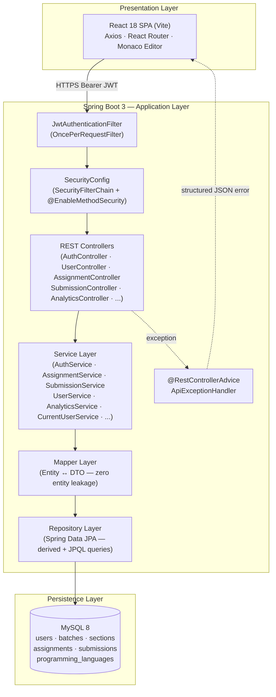
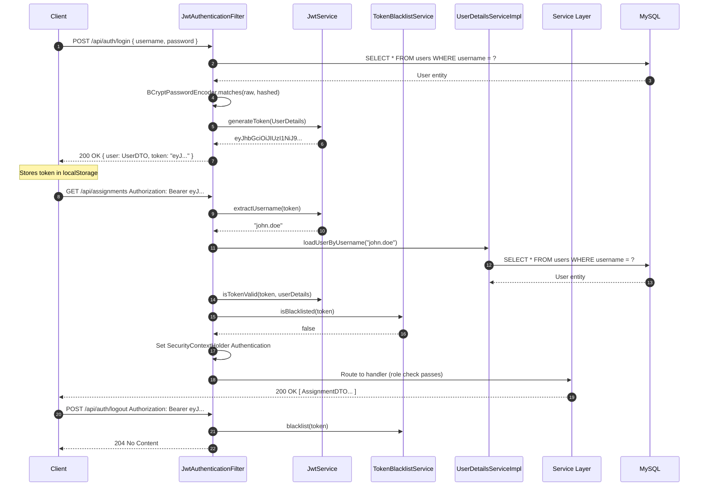
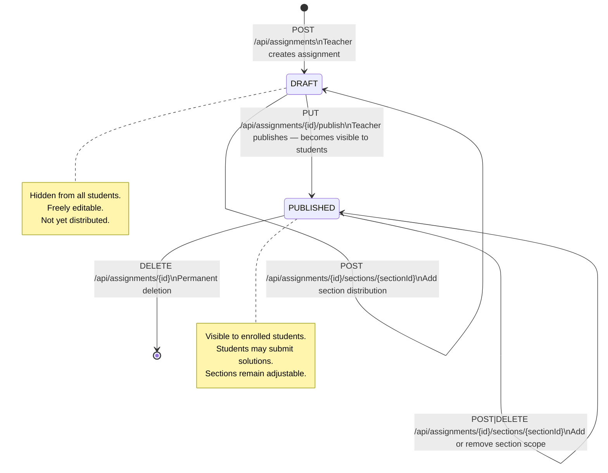
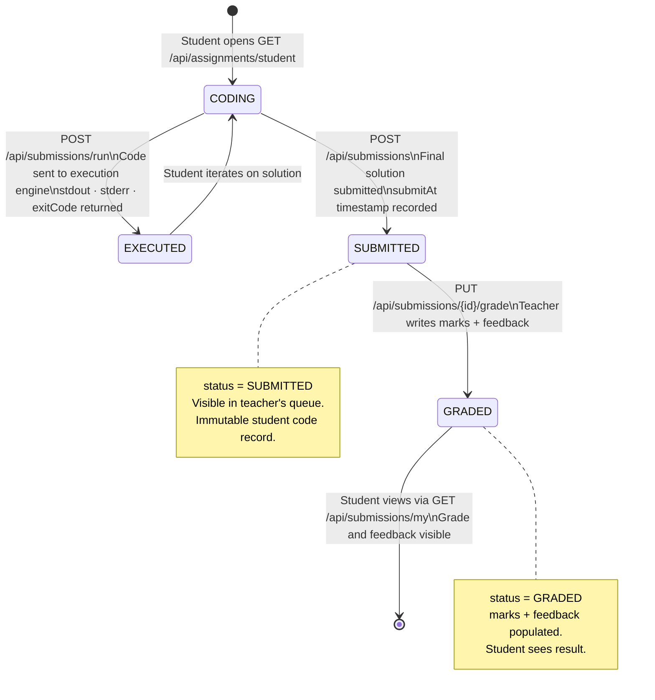
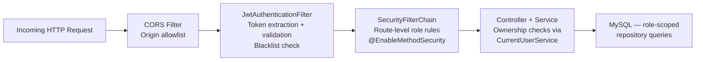

<div align="center">

# 🧪 Virtual Laboratory Platform

### A Production-Grade, Role-Based Educational Platform — Java Spring Boot Backend

<br/>


<br/>


<br/>

> A **backend-centric full-stack platform** for academic programming education. The core system is a **Java 21 + Spring Boot 3** REST API with **stateless JWT authentication**, **fine-grained RBAC**, a structured **assignment → submission → grading workflow**, and role-scoped analytics — all persisted in **MySQL via Hibernate/JPA**. A React 18 SPA serves as the presentation layer.

<br/>

[📖 API Reference](#-rest-api-overview) · [🔐 Security Design](#-security-features) · [🏗️ Architecture](#-system-architecture) · [⚙️ Setup Guide](#-installation-guide)

</div>

---

## 📋 Table of Contents

- [Project Overview](#-project-overview)
- [Problem Statement](#-problem-statement)
- [Solution](#-solution)
- [Key Features](#-key-features)
- [User Roles & RBAC](#-user-roles--rbac)
- [System Architecture](#-system-architecture)
- [Authentication Flow](#-authentication-flow)
- [Assignment Lifecycle](#-assignment-lifecycle)
- [Submission Lifecycle](#-submission-lifecycle)
- [Database Design](#-database-design)
- [Backend Engineering Deep Dive](#-backend-engineering-deep-dive)
- [Security Features](#-security-features)
- [REST API Overview](#-rest-api-overview)
- [Tech Stack](#-tech-stack)
- [Folder Structure](#-folder-structure)
- [Installation Guide](#-installation-guide)
- [Environment Variables](#-environment-variables)
- [Running Locally](#-running-locally)
- [Scalability & Production Readiness](#-scalability--production-readiness)
- [Learning Outcomes](#-learning-outcomes)
- [Future Enhancements](#-future-enhancements)
- [Author](#-author)
- [License](#-license)

---

## 🎯 Project Overview

The **Virtual Laboratory Platform** is a backend-first, full-stack EdTech application built to solve the operational complexity of managing programming education at scale. At its core is a **Spring Boot 3 REST API** that implements:

- **Stateless JWT-based authentication** with token blacklisting on logout
- **Role-Based Access Control (RBAC)** enforced at both route and method level via Spring Security 6
- **Three-tier role hierarchy** — Admin → Teacher → Student — with strictly non-overlapping permission sets
- **Assignment lifecycle management** — Draft → Published → Submitted → Graded — modeled as state machines
- **Paginated, filterable REST APIs** across all entity domains
- **DTO pattern with a dedicated Mapper layer** — zero entity leakage into the API surface
- **Global structured exception handling** — consistent JSON error envelopes across all failure modes
- **Per-role analytics endpoints** — aggregated performance data for each actor in the system

The backend is the engineering heart of the project. The React 18 + Vite frontend consumes the REST API as a presentation layer — all business rules, authorization decisions, and data integrity guarantees live exclusively on the server.

---

## 🔍 Problem Statement

Academic institutions delivering programming courses face a structural workflow problem that grows worse at scale:

| Pain Point | Impact at Scale |
|---|---|
| Assignments distributed via email or chat | No versioning, no delivery confirmation, no central record |
| Submissions collected as ZIP files or Drive links | Manual sorting, error-prone, no audit trail |
| Grading done on paper or ad-hoc spreadsheets | No structured feedback loop, impossible to query |
| Performance data siloed per teacher | No institution-wide view; no per-section analytics |
| No access control on grade data | Students can see each other's marks; teachers see unrelated data |
| No standardized code execution record | No `stdout`, `stderr`, or exit code captured |

For an institution managing 500+ students across 20+ sections, these gaps create **serious operational, academic integrity, and scalability problems**.

---

## 💡 Solution

The Virtual Laboratory Platform replaces the fragmented manual workflow with a **centralized, API-driven platform** governed by four engineering principles:

| Principle | Implementation |
|---|---|
| **Security-first design** | Stateless JWT + BCrypt + RBAC enforced at SecurityFilterChain and method level |
| **Explicit role boundaries** | Three distinct roles; all data access is role-scoped at the repository query level |
| **Typed data contracts** | Full DTO layer; all request/response shapes are explicitly typed and validated |
| **Lifecycle state machines** | Assignment status (`DRAFT`/`PUBLISHED`) and Submission status (`SUBMITTED`/`GRADED`) modeled as database-persisted enums |

Every API endpoint maps to a real workflow step. There are no speculative features — only purposeful, testable engineering decisions.

---

## ✨ Key Features

### 🔒 Security & Infrastructure
- Stateless **JWT Bearer authentication** (HMAC-SHA256, configurable expiry)
- **BCrypt password hashing** via Spring Security `PasswordEncoder`
- **Server-side token blacklisting** — logout is immediately effective, no client-side trust required
- **RBAC at two levels** — `SecurityFilterChain` (route-level) + `@EnableMethodSecurity` (method-level)
- **Global exception handling** — `@RestControllerAdvice` catches all exception types and returns structured `{ "error": "...", "message": "..." }` JSON with correct HTTP status codes
- **Bean Validation** — `jakarta.validation` annotations on every request DTO
- **CORS policy** — explicit origin allowlist; no wildcard origins in production config

### 👨‍💼 Admin Domain
- Full **user lifecycle management** — create, read, update, soft-delete users across all roles
- **Password reset** endpoint (`PUT /users/{id}/password`) with hashed credential replacement
- **Batch management** — define academic cohorts with name, year, and start date
- **Section management** — subdivide batches into sections; enroll and remove individual students
- **Programming Language registry** — register supported languages and versions used during assignment authoring
- **Platform-wide analytics** — user counts, assignment totals, submission volumes, grading rates

### 👩‍🏫 Teacher Domain
- **Assignment authoring** — title, description, starter code template, language, due date, max score
- **Draft → Publish workflow** — assignments are invisible to students until explicitly published via `PUT /assignments/{id}/publish`
- **Section-based distribution** — a single assignment can be assigned to multiple sections via a `@ManyToMany` join table; sections can be added or removed independently
- **Paginated submission review** — filterable by `assignmentId`, `status`, and `sectionId`
- **Grading and feedback** — structured `marks` + `feedback` written per submission via `PUT /submissions/{id}/grade`
- **Role-scoped analytics** — class-level and section-level performance aggregations

### 🎓 Student Domain
- **Section-scoped assignment discovery** — only published assignments for the student's enrolled section are returned
- **Code execution** — `POST /submissions/run` captures `stdout`, `stderr`, `exitCode`, and `executionMs`
- **Formal submission** — `POST /submissions` creates a permanent, timestamped record
- **Submission history** — personal submission list with status tracking
- **Grade and feedback visibility** — marks and written feedback visible after teacher evaluation
- **Personal analytics** — submission count, grading rate, average score

---

## 👤 User Roles & RBAC

The platform enforces a strict, non-overlapping permission model. Role identity is stored in the `User` entity as a database-persisted enum and embedded in the JWT principal, loaded fresh on every request.

```
┌──────────────────────────────────────────────────────────────────────┐
│                        ROLE PERMISSION MATRIX                        │
├─────────────────────────────┬──────────┬──────────┬──────────────────┤
│ Capability                  │  ADMIN   │ TEACHER  │    STUDENT       │
├─────────────────────────────┼──────────┼──────────┼──────────────────┤
│ Create / manage users       │    ✅    │    ❌    │       ❌         │
│ Reset user passwords        │    ✅    │    ❌    │       ❌         │
│ Create / manage batches     │    ✅    │    ❌    │       ❌         │
│ Create / manage sections    │    ✅    │    ❌    │       ❌         │
│ Enroll / remove students    │    ✅    │    ❌    │       ❌         │
│ Register languages          │    ✅    │    ❌    │       ❌         │
│ View admin analytics        │    ✅    │    ❌    │       ❌         │
│ Create assignments          │    ❌    │    ✅    │       ❌         │
│ Publish assignments         │    ❌    │    ✅    │       ❌         │
│ Assign to sections          │    ❌    │    ✅    │       ❌         │
│ Review all submissions      │    ❌    │    ✅    │       ❌         │
│ Grade submissions           │    ❌    │    ✅    │       ❌         │
│ View class analytics        │    ❌    │    ✅    │       ❌         │
│ View published assignments  │    ❌    │    ❌    │       ✅         │
│ Run code                    │    ❌    │    ❌    │       ✅         │
│ Submit solutions            │    ❌    │    ❌    │       ✅         │
│ View own submissions        │    ❌    │    ❌    │       ✅         │
│ View grades & feedback      │    ❌    │    ❌    │       ✅         │
│ View personal analytics     │    ❌    │    ❌    │       ✅         │
└─────────────────────────────┴──────────┴──────────┴──────────────────┘
```

> Authorization is **not** enforced only on the frontend. Every API endpoint validates the authenticated principal's role server-side before any data is accessed or mutated.

---

## 🏗️ System Architecture



### Request Lifecycle

```
HTTP Request
    │
    ▼
JwtAuthenticationFilter          ← Validates Bearer token, checks blacklist
    │
    ▼
SecurityFilterChain              ← Route-level role enforcement
    │
    ▼
REST Controller                  ← Input binding (@Valid), HTTP status codes
    │
    ▼
Service Layer                    ← Business logic, ownership checks (CurrentUserService)
    │
    ▼
Mapper Layer                     ← Entity → DTO (safe serialization boundary)
    │
    ▼
Repository Layer                 ← JPQL / derived queries, Pageable, role-scoped filters
    │
    ▼
MySQL via Hibernate/JPA          ← ORM-managed persistence
```

---

## 🔑 Authentication Flow

Authentication is **stateless**. The server issues a signed JWT on login; every subsequent request must present that token. The server does not maintain session state.



### Token Structure

| Claim | Value | Notes |
|---|---|---|
| `sub` | `username` | Used to reload `UserDetails` from DB on each request |
| `iat` | Issued-at timestamp | Standard JWT claim |
| `exp` | Issued-at + `app.jwt.expiration-ms` | Default 24 hours |
| Signature | HMAC-SHA256 | Signed with `app.jwt.secret` (Base64-encoded) |

> Roles are **not** embedded in the token. They are loaded fresh from the database on every request via `UserDetailsServiceImpl`, ensuring that role changes take effect immediately without token invalidation.

---

## 📝 Assignment Lifecycle



---

## 📤 Submission Lifecycle



---

## 🗄️ Database Design

The schema is organized around three domains: **User & Role Identity**, **Academic Structure**, and **Laboratory Operations**.

```mermaid
erDiagram
    users {
        bigint id PK
        varchar username UK
        varchar full_name
        varchar email
        varchar password
        enum role
        boolean active
    }

    batch {
        bigint id PK
        varchar name
        int year
        date start_date
    }

    section {
        bigint id PK
        varchar name
        bigint batch_id FK
    }

    student {
        bigint id PK_FK
        bigint section_id FK
        bigint batch_id FK
    }

    teacher {
        bigint id PK_FK
    }

    admin {
        bigint id PK_FK
    }

    programming_language {
        bigint id PK
        varchar name
        varchar version
    }

    assignment {
        bigint id PK
        varchar title
        text description
        text starter_code
        bigint teacher_id FK
        bigint language_id FK
        datetime due_date
        int max_score
        enum status
    }

    assignment_sections {
        bigint assignment_id FK
        bigint section_id FK
    }

    submission {
        bigint id PK
        bigint assignment_id FK
        bigint student_id FK
        text code
        datetime submit_at
        int marks
        varchar feedback
        text stdout
        text stderr
        int exit_code
        bigint execution_ms
        enum status
    }

    batch ||--o{ section : "contains"
    section ||--o{ student : "enrolls"
    users ||--o| student : "MapsId"
    users ||--o| teacher : "MapsId"
    users ||--o| admin : "MapsId"
    teacher ||--o{ assignment : "authors"
    programming_language ||--o{ assignment : "specifies"
    assignment }o--o{ section : "assignment_sections"
    assignment ||--o{ submission : "receives"
    student ||--o{ submission : "makes"
```

### Key Schema Engineering Decisions

| Decision | Rationale |
|---|---|
| **Shared PK via `@MapsId` + `@OneToOne`** | `Student`, `Teacher`, and `Admin` share the primary key of `User`. This separates authentication identity from role-specific profile data without duplicating user credentials. |
| **`@ManyToMany` `assignment_sections` join table** | A single assignment can target multiple sections. Sections can be added or removed from an assignment without touching the assignment entity or triggering cascades. |
| **`@Lob` on `code`, `stdout`, `stderr`, `description`, `starterCode`** | Prevents MySQL `VARCHAR(255)` truncation for arbitrarily large code submissions and execution output. Hibernate maps these to `LONGTEXT`. |
| **`@Enumerated(EnumType.STRING)` on all status fields** | Ordinal storage is fragile against enum reordering. String storage is human-readable in the database and safe across refactors. |
| **`boolean active` on `User`** | Supports soft-delete (deactivation) without cascading deletion of historical submissions and grades. |
| **`executionMs` on `Submission`** | Records server-side execution latency per run — useful for future performance-based grading or SLA monitoring. |

---

## 🔧 Backend Engineering Deep Dive

### Package Structure & Layered Responsibility

```
com.virtualLaboratory
├── config/
│   └── SecurityConfig.java          # SecurityFilterChain, CORS, BCrypt, AuthManager
├── controllers/                     # HTTP layer — thin, stateless, delegate to services
│   ├── AuthController.java
│   ├── UserController.java
│   ├── BatchController.java
│   ├── SectionController.java
│   ├── LanguageController.java
│   ├── AssignmentController.java
│   ├── SubmissionController.java
│   └── AnalyticsController.java
├── services/                        # Business logic — all rules live here
│   ├── AuthService.java
│   ├── UserService.java
│   ├── BatchService.java
│   ├── SectionService.java
│   ├── LanguageService.java
│   ├── AssignmentService.java
│   ├── SubmissionService.java
│   ├── AnalyticsService.java
│   └── CurrentUserService.java      # Extracts authenticated principal from SecurityContext
├── repository/                      # Spring Data JPA — queries, pagination, role-scoped filters
│   ├── UserRepository.java
│   ├── StudentRepository.java
│   ├── TeacherRepository.java
│   ├── AdminRepository.java
│   ├── BatchRepository.java
│   ├── SectionRepository.java
│   ├── AssignmentRepository.java
│   ├── SubmissionRepository.java
│   └── ProgrammingLanguageRepository.java
├── entities/                        # JPA domain model — four sub-packages by domain
│   ├── User.java
│   ├── academicStructureEntities/   # Batch, Section
│   ├── academics/                   # Admin, Teacher, Student
│   └── codingLaboratoryEntities/    # Assignment, Submission, ProgrammingLanguage
├── dto/                             # Typed API contracts — 8 domain sub-packages
│   ├── auth/        (LoginRequest, LoginResponse)
│   ├── user/        (UserDTO, UserCreateRequest, UserUpdateRequest, PasswordResetRequest)
│   ├── batch/       (BatchDTO, BatchCreateRequest)
│   ├── section/     (SectionDTO, SectionCreateRequest)
│   ├── language/    (LanguageDTO, LanguageCreateRequest)
│   ├── assignment/  (AssignmentDTO, AssignmentCreateRequest, AssignmentUpdateRequest,
│   │                 AssignmentWithStatusDTO)
│   ├── submission/  (SubmissionDTO, SubmissionCreateRequest, SubmissionGradeRequest,
│   │                 SubmissionRunRequest, SubmissionRunResponse)
│   └── analytics/   (AdminAnalyticsDTO, TeacherAnalyticsDTO,
│                     StudentAnalyticsDTO, SectionAnalyticsDTO)
├── mapper/                          # Entity ↔ DTO conversion — no entity reaches HTTP response
│   ├── UserMapper.java
│   ├── AssignmentMapper.java
│   ├── SubmissionMapper.java
│   ├── BatchMapper.java
│   ├── SectionMapper.java
│   └── LanguageMapper.java
├── security/                        # JWT infrastructure
│   ├── JwtService.java              # Token generation, validation, claim extraction
│   ├── JwtAuthenticationFilter.java # OncePerRequestFilter — intercepts every request
│   ├── TokenBlacklistService.java   # In-memory revocation store
│   └── UserDetailsServiceImpl.java  # Loads UserDetails from DB by username
└── exception/
    ├── ApiExceptionHandler.java     # @RestControllerAdvice — catches all exception types
    ├── ResourceNotFoundException.java
    ├── BadRequestException.java
    ├── ConflictException.java
    └── UnauthorizedException.java
```

### Critical Engineering Decisions

**1. Constructor Injection Throughout**
All Spring beans use constructor injection exclusively. No `@Autowired` field injection. This enforces compile-time dependency resolution, enables proper unit testing without Spring context, and makes the dependency graph explicit and immutable.

**2. `CurrentUserService` — Separation of HTTP and Business Concerns**
A dedicated `CurrentUserService` extracts the authenticated principal from `SecurityContextHolder`. Business services (`AssignmentService`, `SubmissionService`, etc.) call this service to get the current user's identity without importing any `HttpServletRequest` or Spring MVC concerns. This keeps service classes independently testable.

**3. Role-Scoped Repository Queries**
Data visibility is enforced at the **query level**, not by post-fetch filtering. For example, `AssignmentService.getTeacherAssignments()` passes `teacherId` directly into the repository query — a teacher structurally cannot receive another teacher's data, regardless of what parameters are passed.

**4. DTO Pattern with Dedicated Mapper Layer**
No JPA entity ever appears in an HTTP response. The `Mapper` layer converts entities to flat, serialization-safe DTOs before they reach the controller. This prevents:
- `LazyInitializationException` from Hibernate proxies
- Infinite recursion from bidirectional JPA relationships
- Accidental exposure of internal fields (e.g., hashed passwords)

**5. Pageable on All List Endpoints**
Spring's `Pageable` is accepted as a parameter on every collection endpoint. Clients specify `?page=0&size=20&sort=submitAt,desc` at the HTTP layer — the service layer passes it directly to the repository. Zero backend changes are needed to adjust page size or sort order.

**6. Status Enums as State Machines**
`Assignment.Status` (`DRAFT`, `PUBLISHED`) and `Submission.Status` (`SUBMITTED`, `GRADED`) are enforced as database-persisted string enums. State transitions are validated in the service layer — e.g., a teacher cannot unpublish an assignment that has submissions, and a student cannot resubmit a graded solution.

**7. `@RestControllerAdvice` Global Exception Handler**
`ApiExceptionHandler` intercepts seven distinct exception types:

| Exception Type | HTTP Status | Use Case |
|---|---|---|
| `ResourceNotFoundException` | 404 | Entity not found by ID |
| `BadRequestException` | 400 | Invalid business operation |
| `ConflictException` | 409 | Duplicate resource or state conflict |
| `UnauthorizedException` | 401 | Authentication or ownership failure |
| `MethodArgumentNotValidException` | 400 | Bean validation failure (field-level map) |
| `ResponseStatusException` | Dynamic | Framework-level HTTP errors |
| `Exception` (fallback) | 500 | All uncaught exceptions — masked to "Internal server error" |

All responses follow the same envelope: `{ "error": "message", "message": "message" }`. No stack traces ever reach the HTTP response.

---

## 🔐 Security Features

### Multi-Layer Security Model



| Security Layer | Mechanism | What It Protects Against |
|---|---|---|
| **CORS** | `CorsConfigurationSource` — explicit origin allowlist | Cross-origin requests from unauthorized domains |
| **Transport Auth** | JWT Bearer, HMAC-SHA256 signed | Unauthenticated API access |
| **Password Storage** | `BCryptPasswordEncoder` (Spring Security default) | Credential theft via DB compromise |
| **Session Strategy** | `SessionCreationPolicy.STATELESS` | Session fixation, CSRF via cookie sessions |
| **Token Revocation** | `TokenBlacklistService` in-memory store | Continued access after logout |
| **Route RBAC** | `SecurityFilterChain` per-path `hasRole()` rules | Wrong-role endpoint access |
| **Method RBAC** | `@EnableMethodSecurity` + `@PreAuthorize` | Fine-grained per-operation authorization |
| **Ownership Enforcement** | `CurrentUserService` in business logic | Teachers accessing other teachers' data |
| **Input Validation** | `jakarta.validation` on all request DTOs | Malformed input, constraint violations |
| **Error Masking** | Fallback `Exception` handler → HTTP 500 + generic message | Stack trace leakage in production |

### `SecurityConfig` Highlights

```java
http
  .csrf(csrf -> csrf.disable())                             // Stateless — no CSRF needed
  .cors(cors -> cors.configurationSource(corsConfigurationSource()))
  .sessionManagement(s -> s.sessionCreationPolicy(STATELESS))
  .authorizeHttpRequests(auth -> auth
      .requestMatchers(HttpMethod.OPTIONS, "/**").permitAll()
      .requestMatchers(HttpMethod.POST, "/api/auth/**").permitAll()
      .requestMatchers("/api/users/**").permitAll()          // Registration is public
      .requestMatchers("/error").permitAll()
      .anyRequest().authenticated()
  )
  .addFilterBefore(jwtFilter, UsernamePasswordAuthenticationFilter.class);
```

---

## 📡 REST API Overview

All endpoints are prefixed with `/api`. All protected endpoints require `Authorization: Bearer <token>`.

### Authentication

| Method | Endpoint | Access | Description |
|---|---|---|---|
| `POST` | `/auth/login` | Public | Authenticate; receive JWT + UserDTO |
| `POST` | `/auth/logout` | Bearer | Blacklist token; immediate logout |
| `GET` | `/auth/me` | Bearer | Get current authenticated user |

### User Management

| Method | Endpoint | Role | Description |
|---|---|---|---|
| `POST` | `/users` | Public | Create user account |
| `GET` | `/users` | Admin | List users (paginated; filter by `role`, `batchId`) |
| `GET` | `/users/{id}` | Admin | Get user by ID |
| `PUT` | `/users/{id}` | Admin | Update user details |
| `DELETE` | `/users/{id}` | Admin | Deactivate user |
| `PUT` | `/users/{id}/password` | Admin | Reset user password |

### Batch & Section Management

| Method | Endpoint | Role | Description |
|---|---|---|---|
| `GET` | `/batches` | Admin | List all batches |
| `POST` | `/batches` | Admin | Create batch |
| `PUT` | `/batches/{id}` | Admin | Update batch |
| `DELETE` | `/batches/{id}` | Admin | Delete batch |
| `GET` | `/sections` | Admin | List sections (filter by `batchId`) |
| `POST` | `/sections` | Admin | Create section |
| `PUT` | `/sections/{id}` | Admin | Update section |
| `DELETE` | `/sections/{id}` | Admin | Delete section |
| `GET` | `/sections/{id}/students` | Admin | List enrolled students |
| `POST` | `/sections/{id}/students/{studentId}` | Admin | Enroll student |
| `DELETE` | `/sections/{id}/students/{studentId}` | Admin | Remove student |

### Assignment Management

| Method | Endpoint | Role | Description |
|---|---|---|---|
| `GET` | `/assignments` | Teacher | List own assignments (paginated; filter by `status`, `sectionId`) |
| `POST` | `/assignments` | Teacher | Create assignment (status: `DRAFT`) |
| `GET` | `/assignments/{id}` | Teacher | Get assignment details |
| `PUT` | `/assignments/{id}` | Teacher | Update assignment |
| `DELETE` | `/assignments/{id}` | Teacher | Delete assignment |
| `PUT` | `/assignments/{id}/publish` | Teacher | Transition status to `PUBLISHED` |
| `POST` | `/assignments/{id}/sections/{sectionId}` | Teacher | Assign to a section |
| `DELETE` | `/assignments/{id}/sections/{sectionId}` | Teacher | Remove from a section |
| `GET` | `/assignments/student` | Student | Get published assignments for own section |
| `GET` | `/assignments/{id}/submissions` | Teacher | List submissions for an assignment |

### Submission Management

| Method | Endpoint | Role | Description |
|---|---|---|---|
| `POST` | `/submissions/run` | Student | Execute code; returns `stdout`, `stderr`, `exitCode`, `executionMs` |
| `POST` | `/submissions` | Student | Formally submit solution (status: `SUBMITTED`) |
| `GET` | `/submissions` | Teacher | List submissions (paginated; filter by `assignmentId`, `status`, `sectionId`) |
| `GET` | `/submissions/{id}` | Teacher / Student | Get submission detail |
| `PUT` | `/submissions/{id}/grade` | Teacher | Write marks + feedback (status → `GRADED`) |
| `GET` | `/submissions/my` | Student | Get own submission history |

### Analytics

| Method | Endpoint | Role | Description |
|---|---|---|---|
| `GET` | `/analytics/admin` | Admin | Platform-wide aggregation |
| `GET` | `/analytics/teacher` | Teacher | Class-level stats (filter by `sectionId`) |
| `GET` | `/analytics/student` | Student | Personal performance stats |
| `GET` | `/analytics/sections/{id}` | Teacher | Section-level performance breakdown |

### Programming Languages

| Method | Endpoint | Role | Description |
|---|---|---|---|
| `GET` | `/languages` | All | List registered languages |
| `POST` | `/languages` | Admin | Register new language |
| `PUT` | `/languages/{id}` | Admin | Update language record |
| `DELETE` | `/languages/{id}` | Admin | Remove language |

### API Design Principles

- **Resource-based URLs**: `/api/{resource}` and `/api/{resource}/{id}` — no verbs in paths
- **HTTP verb semantics**: `GET` reads, `POST` creates, `PUT` full updates, `DELETE` removes
- **Uniform error contract**: all failures → `{ "error": "...", "message": "..." }` with correct status code
- **Field-level validation errors**: `{ "fieldName": "constraint message" }` on 400 responses
- **Pagination**: Spring `Pageable` (`?page=0&size=20&sort=field,direction`) on all collections
- **Filtering via query params**: `?status=PUBLISHED&sectionId=3` for scoped queries
- **No entity leakage**: all responses are DTO instances — internal fields never reach the wire

---

## 🛠️ Tech Stack

### Backend (Primary)

| Technology | Version | Role |
|---|---|---|
| **Java** | 21 (LTS) | Language runtime |
| **Spring Boot** | 3.2.2 | Application framework, auto-configuration |
| **Spring Security** | 6.x | Authentication, authorization, filter pipeline |
| **Spring Data JPA** | 3.2.x | Repository abstraction, derived & JPQL queries |
| **Hibernate** | 6.x | ORM engine, DDL generation, session management |
| **JJWT** (`io.jsonwebtoken`) | 0.11.5 | JWT generation, parsing, HMAC-SHA256 signing |
| **MySQL Connector/J** | Runtime | JDBC driver for MySQL 8 |
| **Lombok** | 1.18.44 | Compile-time boilerplate reduction (`@Data`, `@Builder`) |
| **H2 Database** | Test scope | In-memory DB for integration tests |
| **Maven** | 3.9.x | Build lifecycle, dependency management |

### Frontend (Presentation Layer)

| Technology | Version | Role |
|---|---|---|
| **React** | 18.3.1 | UI component model |
| **Vite** | 5.3.4 | Build tool, HMR dev server |
| **React Router DOM** | 6.26.0 | Client-side routing with nested layouts |
| **Tailwind CSS** | 3.4.6 | Utility-first styling |
| **Axios** | 1.7.2 | HTTP client with JWT interceptor |
| **@monaco-editor/react** | 4.6.0 | In-browser VS Code editor |
| **Recharts** | 2.12.7 | Analytics chart components |

---

## 📁 Folder Structure

```
virtualLaboratory/
│
├── backend/                                  ← Spring Boot application (PRIMARY)
│   ├── pom.xml
│   └── src/
│       ├── main/
│       │   ├── java/com/virtualLaboratory/
│       │   │   ├── VirtualLaboratoryApplication.java
│       │   │   ├── config/
│       │   │   │   └── SecurityConfig.java
│       │   │   ├── controllers/
│       │   │   │   ├── AuthController.java
│       │   │   │   ├── UserController.java
│       │   │   │   ├── BatchController.java
│       │   │   │   ├── SectionController.java
│       │   │   │   ├── LanguageController.java
│       │   │   │   ├── AssignmentController.java
│       │   │   │   ├── SubmissionController.java
│       │   │   │   └── AnalyticsController.java
│       │   │   ├── services/
│       │   │   │   ├── AuthService.java
│       │   │   │   ├── UserService.java
│       │   │   │   ├── BatchService.java
│       │   │   │   ├── SectionService.java
│       │   │   │   ├── LanguageService.java
│       │   │   │   ├── AssignmentService.java
│       │   │   │   ├── SubmissionService.java
│       │   │   │   ├── AnalyticsService.java
│       │   │   │   └── CurrentUserService.java
│       │   │   ├── repository/
│       │   │   │   ├── UserRepository.java
│       │   │   │   ├── StudentRepository.java
│       │   │   │   ├── TeacherRepository.java
│       │   │   │   ├── AdminRepository.java
│       │   │   │   ├── BatchRepository.java
│       │   │   │   ├── SectionRepository.java
│       │   │   │   ├── AssignmentRepository.java
│       │   │   │   ├── SubmissionRepository.java
│       │   │   │   └── ProgrammingLanguageRepository.java
│       │   │   ├── entities/
│       │   │   │   ├── User.java
│       │   │   │   ├── academicStructureEntities/
│       │   │   │   │   ├── Batch.java
│       │   │   │   │   └── Section.java
│       │   │   │   ├── academics/
│       │   │   │   │   ├── Admin.java
│       │   │   │   │   ├── Teacher.java
│       │   │   │   │   └── Student.java
│       │   │   │   └── codingLaboratoryEntities/
│       │   │   │       ├── Assignment.java
│       │   │   │       ├── Submission.java
│       │   │   │       └── ProgrammingLanguage.java
│       │   │   ├── dto/
│       │   │   │   ├── auth/
│       │   │   │   ├── user/
│       │   │   │   ├── batch/
│       │   │   │   ├── section/
│       │   │   │   ├── language/
│       │   │   │   ├── assignment/
│       │   │   │   ├── submission/
│       │   │   │   └── analytics/
│       │   │   ├── mapper/
│       │   │   │   ├── UserMapper.java
│       │   │   │   ├── AssignmentMapper.java
│       │   │   │   ├── SubmissionMapper.java
│       │   │   │   └── ...
│       │   │   ├── security/
│       │   │   │   ├── JwtService.java
│       │   │   │   ├── JwtAuthenticationFilter.java
│       │   │   │   ├── TokenBlacklistService.java
│       │   │   │   └── UserDetailsServiceImpl.java
│       │   │   └── exception/
│       │   │       ├── ApiExceptionHandler.java
│       │   │       ├── ResourceNotFoundException.java
│       │   │       ├── BadRequestException.java
│       │   │       ├── ConflictException.java
│       │   │       └── UnauthorizedException.java
│       │   └── resources/
│       │       └── application.properties
│       └── test/
│
└── frontend/                                 ← React 18 SPA (Presentation Layer)
    ├── package.json
    ├── vite.config.js
    ├── tailwind.config.js
    └── src/
        ├── App.jsx
        ├── context/          # AuthContext, ThemeContext
        ├── components/       # AppShell, ProtectedRoute, ErrorBoundary, UI primitives
        ├── pages/            # admin/ · teacher/ · student/ · auth/
        ├── services/         # apiClient.js (Axios + JWT), index.js (all API methods)
        ├── hooks/
        └── utils/
```

---

## ⚙️ Installation Guide

### Prerequisites

| Tool | Version | Notes |
|---|---|---|
| **JDK** | 21+ | [Adoptium Temurin](https://adoptium.net/) recommended |
| **Maven** | 3.9+ | Or use the included `./mvnw` wrapper |
| **MySQL** | 8.0+ | Local instance or Docker |
| **Node.js** | 18+ | Only required to run the frontend |

### 1. Clone the Repository

```bash
git clone https://github.com/ansfaiz/virtualLaboratory.git
cd virtualLaboratory
```

### 2. Database Setup

```sql
-- Run against your MySQL 8 instance
CREATE DATABASE virtual_lab
  CHARACTER SET utf8mb4
  COLLATE utf8mb4_unicode_ci;

CREATE USER 'vlab_user'@'localhost' IDENTIFIED BY 'your_secure_password';
GRANT ALL PRIVILEGES ON virtual_lab.* TO 'vlab_user'@'localhost';
FLUSH PRIVILEGES;
```

### 3. Backend Configuration

```bash
cd backend
```

Edit `src/main/resources/application.properties`:

```properties
# Datasource
spring.datasource.url=jdbc:mysql://localhost:3306/virtual_lab?useSSL=false&serverTimezone=UTC
spring.datasource.username=vlab_user
spring.datasource.password=your_secure_password
spring.datasource.driver-class-name=com.mysql.cj.jdbc.Driver

# JPA / Hibernate
spring.jpa.database-platform=org.hibernate.dialect.MySQLDialect
spring.jpa.hibernate.ddl-auto=update
spring.jpa.show-sql=false

# JWT
app.jwt.secret=your-256-bit-base64-secret-minimum-32-characters-long
app.jwt.expiration-ms=86400000

# Server
server.port=8080
```

### 4. Frontend Configuration

```bash
cd frontend
npm install
```

Create `frontend/.env.local`:

```env
VITE_API_BASE_URL=http://localhost:8080/api
```

---

## 🌍 Environment Variables

### Backend — `application.properties`

| Property | Description | Default |
|---|---|---|
| `spring.datasource.url` | MySQL JDBC URL | — |
| `spring.datasource.username` | Database username | — |
| `spring.datasource.password` | Database password | — |
| `spring.jpa.hibernate.ddl-auto` | Schema strategy | `update` |
| `app.jwt.secret` | HMAC-SHA256 signing key (min. 32 chars) | Dev fallback |
| `app.jwt.expiration-ms` | Token lifetime in milliseconds | `86400000` (24h) |
| `server.port` | HTTP server port | `8080` |

### Frontend — `.env.local`

| Variable | Description | Default |
|---|---|---|
| `VITE_API_BASE_URL` | Backend REST API base URL | `http://localhost:8080/api` |

---

## 🚀 Running Locally

### Start the Backend (Spring Boot)

```bash
cd backend

# Using the Maven wrapper (no local Maven install required)
./mvnw spring-boot:run

# API available at:
# http://localhost:8080/api
```

Hibernate will auto-create all tables on first run (`ddl-auto=update`).

### Start the Frontend (React + Vite)

```bash
cd frontend
npm run dev

# SPA available at:
# http://localhost:5173
```

---

## 📈 Scalability & Production Readiness

| Concern | Current Implementation | Production Path |
|---|---|---|
| **Stateless auth** | JWT — no server-side sessions | Trivially horizontally scalable — add instances behind a load balancer with no session affinity |
| **Token revocation** | In-memory blacklist | Replace with **Redis** for distributed token revocation across multiple instances |
| **Pagination** | Spring `Pageable` on all collection endpoints | No change needed — query-level pagination is already enforced |
| **Database connection pooling** | Spring Boot default (HikariCP) | Configure `spring.datasource.hikari.*` for pool sizing in production |
| **Schema management** | `ddl-auto=update` for development | Switch to `ddl-auto=validate` + **Flyway** or **Liquibase** for production migrations |
| **Secret management** | `application.properties` | Externalize to environment variables or **AWS Secrets Manager / HashiCorp Vault** |
| **Logging** | Spring Boot default (`logback`) | Add structured JSON logging (Logstash encoder) for log aggregation pipelines |
| **Monitoring** | — | Add **Spring Boot Actuator** + **Micrometer** + Prometheus/Grafana |

---

## 📚 Learning Outcomes

Building this platform provided hands-on experience with production-pattern backend engineering:

- ✅ Implementing **stateless JWT authentication** from scratch in Spring Security 6 (no starter magic)
- ✅ Configuring `SecurityFilterChain` with route-level rules and method-level `@PreAuthorize`
- ✅ Designing and enforcing **RBAC** across a multi-role domain with zero cross-role data leakage
- ✅ Building a **layered Spring Boot application** with clear package boundaries and single responsibility
- ✅ Implementing the **DTO pattern** with a dedicated Mapper layer as a hard serialization boundary
- ✅ Designing a **normalized relational schema** with `@ManyToMany`, `@OneToOne` with shared PK (`@MapsId`), and `@Lob`
- ✅ Writing **global exception handling** with structured JSON error contracts across all failure modes
- ✅ Modeling **entity state machines** (Assignment and Submission lifecycle) with database-persisted string enums
- ✅ Using **Spring Data JPA** with derived queries, JPQL, and `Pageable` for scalable data access
- ✅ Building role-scoped **analytics aggregation** endpoints without leaking cross-role data

---

## 🔮 Future Enhancements

| Feature | Description | Priority |
|---|---|---|
| **Real Code Execution Engine** | Integrate with **Judge0** or **Piston API** for sandboxed, multi-language server-side execution with resource limits | 🔴 High |
| **Redis Token Blacklist** | Replace in-memory `TokenBlacklistService` with Redis for distributed multi-instance deployment | 🔴 High |
| **Refresh Token Rotation** | Implement sliding-window refresh token flow for extended sessions without re-authentication | 🟡 Medium |
| **JUnit 5 Test Suite** | Unit tests for all service classes (Mockito), integration tests for controllers (`@SpringBootTest` + TestContainers) | 🟡 Medium |
| **Flyway Migrations** | Replace `ddl-auto=update` with versioned SQL migration scripts for safe production schema changes | 🟡 Medium |
| **Spring Boot Actuator** | Health checks, metrics endpoints, and Micrometer integration for Prometheus/Grafana observability | 🟡 Medium |
| **WebSocket Notifications** | Push notifications to teachers on new submissions; to students when graded | 🟡 Medium |
| **OpenAPI / Swagger UI** | Auto-generate interactive API documentation from controllers via Springdoc OpenAPI 2 | 🟢 Low |
| **Docker Compose** | Containerize backend + MySQL + frontend for one-command local environment setup | 🟢 Low |
| **CI/CD Pipeline** | GitHub Actions: build → test → Docker image → deploy on every push to `main` | 🟢 Low |
| **Email Notifications** | Spring Mail: notify students on assignment publication, notify teachers on new submissions | 🟢 Low |

---

## 👨‍💻 Author

<div align="center">

**Ans Faiz**

*Java Backend Developer · Spring Boot Engineer · Full-Stack Developer*

[](https://github.com/ansfaiz)

<br/>

*Built with ☕ Java 21 + Spring Boot 3 · engineered to production-grade standards.*

</div>

---

## 📄 License

```
MIT License

Copyright (c) 2026 Ans Faiz

Permission is hereby granted, free of charge, to any person obtaining a copy
of this software and associated documentation files (the "Software"), to deal
in the Software without restriction, including without limitation the rights
to use, copy, modify, merge, publish, distribute, sublicense, and/or sell
copies of the Software, and to permit persons to whom the Software is
furnished to do so, subject to the following conditions:

The above copyright notice and this permission notice shall be included in all
copies or substantial portions of the Software.

THE SOFTWARE IS PROVIDED "AS IS", WITHOUT WARRANTY OF ANY KIND, EXPRESS OR
IMPLIED, INCLUDING BUT NOT LIMITED TO THE WARRANTIES OF MERCHANTABILITY,
FITNESS FOR A PARTICULAR PURPOSE AND NONINFRINGEMENT. IN NO EVENT SHALL THE
AUTHORS OR COPYRIGHT HOLDERS BE LIABLE FOR ANY CLAIM, DAMAGES OR OTHER
LIABILITY, WHETHER IN AN ACTION OF CONTRACT, TORT OR OTHERWISE, ARISING FROM,
OUT OF OR IN CONNECTION WITH THE SOFTWARE OR THE USE OR OTHER DEALINGS IN
THE SOFTWARE.
```

---

<div align="center">

⭐ **If this project demonstrates engineering quality, consider giving it a star on GitHub** ⭐

</div>
