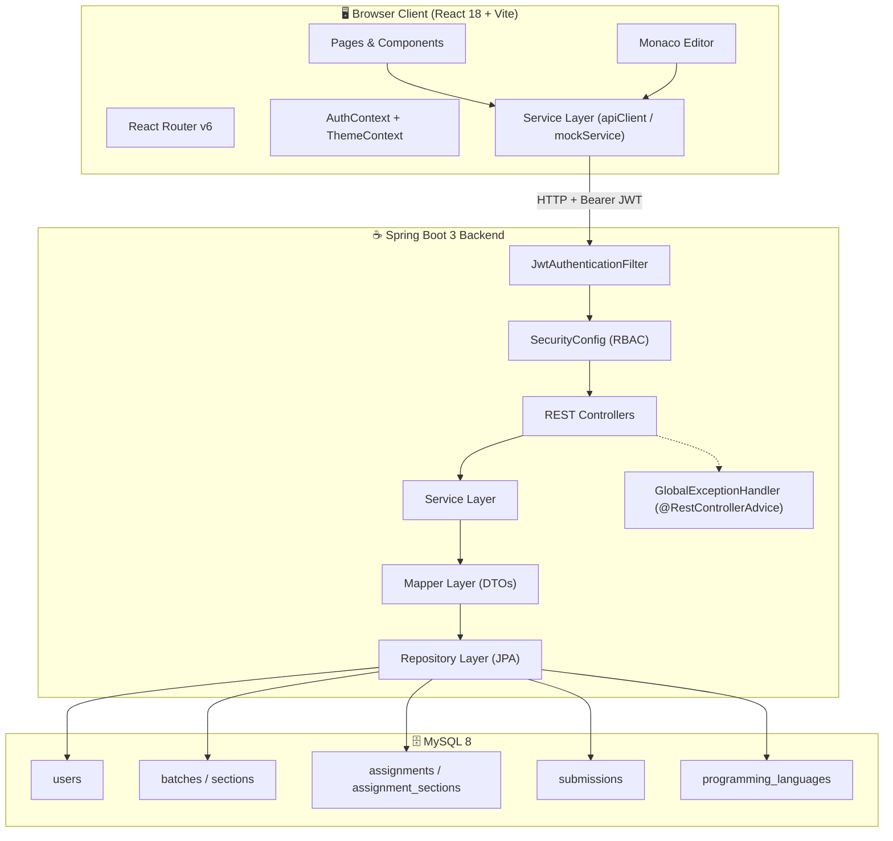
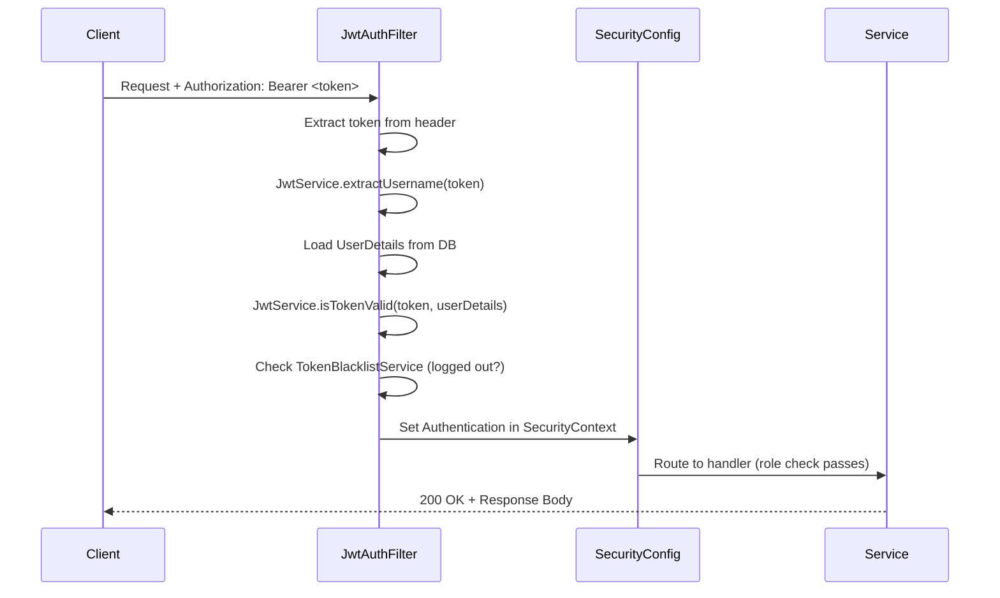
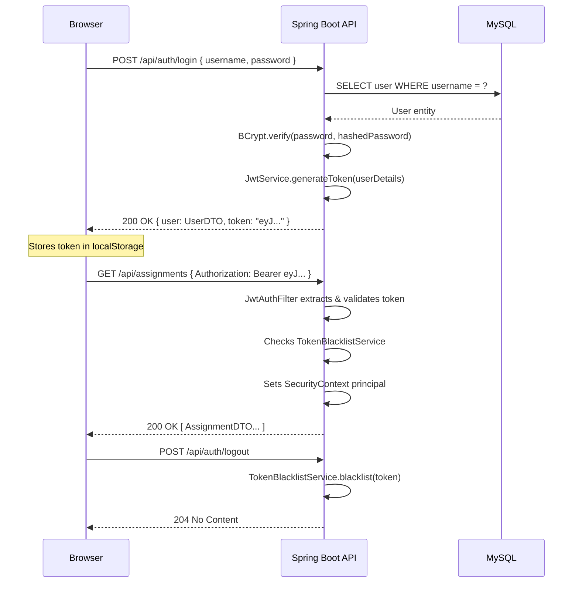
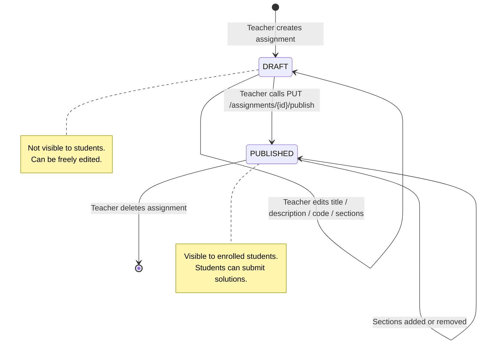
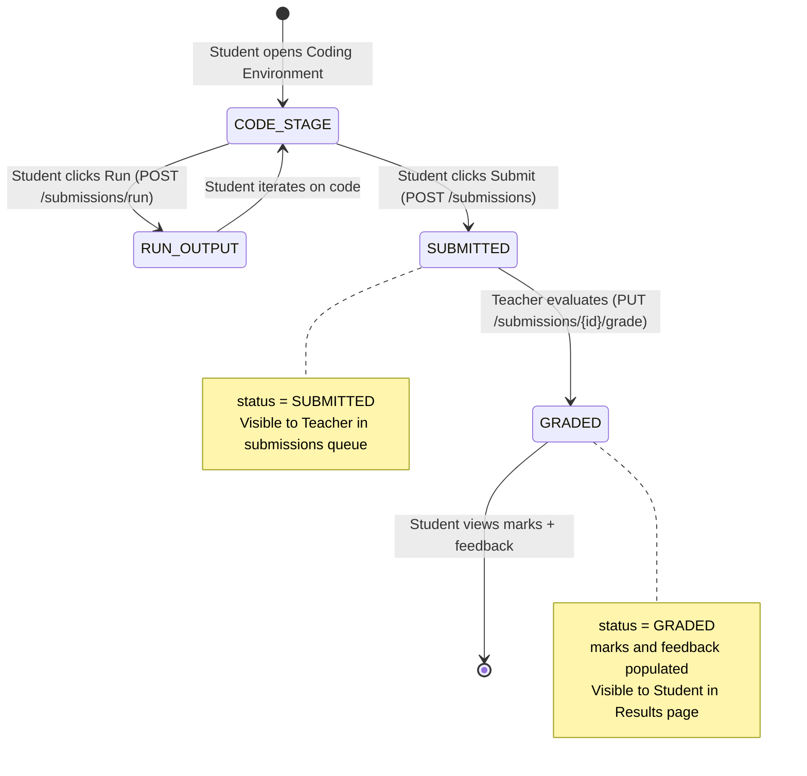

<div align="center">

# 🧪 Virtual Laboratory Platform

### A Production-Grade, Role-Based Educational Programming Environment

<br/>


<br/>


<br/>

> **A full-stack, multi-role laboratory management platform** that enables institutions to manage programming assignments, student submissions, and academic performance tracking through a secure, stateless REST API and an interactive React frontend with an embedded code editor.

<br/>

[🚀 Live Demo](#-screenshots) · [📖 API Reference](#-api-endpoints-overview) · [⚙️ Setup Guide](#-installation-guide) · [🏗️ Architecture](#️-architecture-overview)

</div>

---

## 📋 Table of Contents

- [Project Overview](#-project-overview)
- [Problem Statement](#-problem-statement)
- [Solution Approach](#-solution-approach)
- [Key Features](#-key-features)
- [User Roles & Permissions](#-user-roles--permissions)
- [System Workflow](#-system-workflow)
- [Architecture Overview](#️-architecture-overview)
- [High-Level Architecture Diagram](#-high-level-architecture-diagram)
- [Backend Architecture](#-backend-architecture)
- [Frontend Architecture](#-frontend-architecture)
- [Database Design](#-database-design-overview)
- [API Design Philosophy](#-api-design-philosophy)
- [Security Features](#-security-features)
- [Screenshots](#-screenshots)
- [Tech Stack](#-tech-stack)
- [Folder Structure](#-folder-structure)
- [Installation Guide](#-installation-guide)
- [Environment Variables](#-environment-variables)
- [Running Locally](#-running-locally)
- [API Endpoints Overview](#-api-endpoints-overview)
- [Authentication Flow](#-authentication-flow)
- [Assignment Lifecycle](#-assignment-lifecycle)
- [Submission Lifecycle](#-submission-lifecycle)
- [Engineering Challenges Solved](#-engineering-challenges-solved)
- [Why This Project Matters](#-why-this-project-matters)
- [Learning Outcomes](#-learning-outcomes)
- [Future Enhancements](#-future-enhancements)
- [Author](#-author)
- [License](#-license)

---

## 🎯 Project Overview

The **Virtual Laboratory Platform** is a production-grade, multi-role web application designed for academic institutions that deliver programming education. It provides a centralized environment where **Admins** orchestrate the institutional structure, **Teachers** author and evaluate programming assignments, and **Students** write, run, and submit code — all within a unified, secure platform.

The backend is built on **Java 21 + Spring Boot 3**, enforcing stateless authentication via **JWT tokens** and fine-grained access control through **Role-Based Access Control (RBAC)**. The frontend is a **React 18 SPA** powered by **Vite** with a fully integrated **Monaco Editor** (the same engine powering VS Code), delivering a professional in-browser coding experience.

This project demonstrates enterprise-grade engineering practices including layered architecture, DTO pattern, global exception handling, repository abstraction, and a clean service-boundary design — all within a real-world educational domain.

---

## 🔍 Problem Statement

Traditional academic programming courses rely on manual, fragmented workflows:

- 📧 Assignments distributed via email or messaging apps — no versioning, no tracking.
- 📂 Submissions collected as ZIP files or shared drive links — error-prone, unscalable.
- 🗒️ Grading done manually from printed sheets or ad-hoc scripts — no structured feedback loop.
- 📊 Performance tracking done in spreadsheets — with no real-time visibility for teachers or students.
- 🔒 No access control — sensitive data like grades or evaluation notes exposed to wrong roles.

For institutions with hundreds of students across multiple batches and sections, these gaps create serious operational, academic integrity, and scalability problems.

---

## 💡 Solution Approach

The Virtual Laboratory Platform replaces the fragmented workflow with a **single, role-aware platform** built around four core engineering principles:

| Principle | Implementation |
|---|---|
| **Security-first** | Stateless JWT auth + BCrypt password hashing + RBAC at method & route level |
| **Clear role boundaries** | Three distinct user roles with non-overlapping permission sets |
| **Structured data contracts** | Full DTO layer separating internal entity model from API surface |
| **Auditability** | Timestamped submissions, status state machines, and per-role analytics endpoints |

Every feature maps directly to a real workflow pain point — there are no speculative features, only purposeful engineering decisions.

---

## ✨ Key Features

### 🛡️ Platform & Security
- **Stateless JWT Authentication** with configurable expiry and server-side token blacklisting on logout
- **BCrypt password hashing** (Spring Security `PasswordEncoder`)
- **Role-Based Access Control** enforced at both route level (`SecurityFilterChain`) and method level (`@EnableMethodSecurity`)
- **Global Exception Handling** via `@RestControllerAdvice` — structured JSON error responses for all failure modes
- **Input validation** via `jakarta.validation` annotations on all request DTOs
- **CORS policy** configured for controlled origin allowlisting

### 👨‍💼 Admin Capabilities
- Full **User Management** — create, update, deactivate users across all roles (Admin, Teacher, Student)
- **Batch management** — define academic cohorts with year and start date
- **Section management** — subdivide batches into sections; enroll/remove students per section
- **Programming Language registry** — add/remove supported languages (used by assignment authoring)
- **Platform-wide analytics** — total users, assignments, submission rates, and activity overview

### 👩‍🏫 Teacher Capabilities
- **Assignment authoring** with title, rich description, starter code template, language selection, due date, and max score
- **Draft → Published** workflow — assignments remain hidden from students until explicitly published
- **Section-based distribution** — assign to one or multiple sections; remove sections without deleting the assignment
- **Submission review** — paginated, filterable view of all student submissions per assignment
- **Evaluation & Grading** — assign marks and structured written feedback per submission
- **Performance analytics** — class-level and section-level statistics with submission and grading rates

### 🎓 Student Capabilities
- **Assignment discovery** — view all published assignments scoped to their enrolled section
- **Integrated coding environment** powered by Monaco Editor with language-aware syntax highlighting
- **Code execution** — run code and see `stdout`, `stderr`, and `exit code` in real-time before final submission
- **Submission tracking** — history of all personal submissions with status (`SUBMITTED`, `GRADED`) and timestamps
- **Grades & Feedback** — view assigned marks and teacher feedback per submission
- **Personal analytics** — submission count, graded count, average score dashboard

---

## 👤 User Roles & Permissions

```
┌─────────────────────────────────────────────────────────────────────┐
│                     ROLE PERMISSION MATRIX                          │
├─────────────────────────┬──────────┬──────────┬─────────────────────┤
│ Capability              │  ADMIN   │ TEACHER  │      STUDENT        │
├─────────────────────────┼──────────┼──────────┼─────────────────────┤
│ Manage users            │    ✅    │    ❌    │         ❌          │
│ Manage batches          │    ✅    │    ❌    │         ❌          │
│ Manage sections         │    ✅    │    ❌    │         ❌          │
│ Manage languages        │    ✅    │    ❌    │         ❌          │
│ View admin analytics    │    ✅    │    ❌    │         ❌          │
│ Create assignments      │    ❌    │    ✅    │         ❌          │
│ Publish assignments     │    ❌    │    ✅    │         ❌          │
│ Review submissions      │    ❌    │    ✅    │         ❌          │
│ Grade submissions       │    ❌    │    ✅    │         ❌          │
│ View teacher analytics  │    ❌    │    ✅    │         ❌          │
│ View assignments        │    ❌    │    ❌    │         ✅          │
│ Run & submit code       │    ❌    │    ❌    │         ✅          │
│ View own submissions    │    ❌    │    ❌    │         ✅          │
│ View grades & feedback  │    ❌    │    ❌    │         ✅          │
│ View personal analytics │    ❌    │    ❌    │         ✅          │
└─────────────────────────┴──────────┴──────────┴─────────────────────┘
```

---

## 🔄 System Workflow

```
┌──────────────────────────────────────────────────────────────────────────────┐
│                         PLATFORM WORKFLOW                                    │
│                                                                              │
│  ADMIN                    TEACHER                      STUDENT               │
│  ─────                    ───────                      ───────               │
│  Create Batch         →   (Assigned to Batch)      →   (Enrolled in Section) │
│  Create Section       →   Create Assignment        →   View Published Assgn  │
│  Enroll Students      →   Add Starter Code         →   Open Coding Env       │
│  Register Languages   →   Set Due Date & Score     →   Write / Run Code      │
│  Create Teacher User  →   Publish Assignment       →   Submit Solution       │
│  Monitor Activity     →   Review Submissions       →   View Status           │
│                       →   Evaluate & Grade         →   Receive Feedback      │
│                       →   View Class Performance   →   View Grade & Score    │
└──────────────────────────────────────────────────────────────────────────────┘
```

---

## 🏗️ Architecture Overview

The platform follows a **classic layered architecture** (Presentation → Service → Repository → Database), with a clean separation of concerns at every layer boundary. The frontend communicates exclusively through the REST API — there is no shared code, no session state, and no server-side rendering.

```
┌─────────────────────────────────────┐
│         React 18 SPA (Vite)         │  ← Presentation Layer
│  Monaco Editor · React Router · Axios│
└──────────────┬──────────────────────┘
               │  HTTPS / REST (JSON)
               │  Authorization: Bearer <JWT>
┌──────────────▼──────────────────────┐
│     Spring Boot 3 REST API          │  ← Application Layer
│  Controllers → Services → Repos     │
│  JWT Filter → SecurityFilterChain   │
└──────────────┬──────────────────────┘
               │  JPA / Hibernate
┌──────────────▼──────────────────────┐
│           MySQL 8 Database          │  ← Persistence Layer
│  users · batches · sections ·       │
│  assignments · submissions · ...    │
└─────────────────────────────────────┘
```

---

## 📊 High-Level Architecture Diagram



---

## 🔧 Backend Architecture

The Spring Boot backend is organized into nine distinct packages, each with a single, well-defined responsibility:

```
com.virtualLaboratory
├── config/           # Security config, CORS, authentication beans
├── controllers/      # REST endpoints — thin, delegate to services
├── services/         # All business logic — stateless, transactional
├── repository/       # Spring Data JPA repositories
├── entities/         # JPA entity model (4 sub-packages by domain)
│   ├── User.java
│   ├── academicStructureEntities/   (Batch, Section)
│   ├── academics/                   (Admin, Teacher, Student, Deen)
│   └── codingLaboratoryEntities/    (Assignment, Submission, ProgrammingLanguage)
├── dto/              # Request/Response DTOs (8 domain sub-packages)
├── mapper/           # Entity ↔ DTO conversion
├── security/         # JWT service, auth filter, token blacklist, UserDetailsService
└── exception/        # Custom exceptions + @RestControllerAdvice handler
```

### Layered Responsibility Model

| Layer | Class(es) | Responsibility |
|---|---|---|
| **Controller** | `AssignmentController`, `SubmissionController`, … | HTTP routing, input binding, status codes |
| **Service** | `AssignmentService`, `SubmissionService`, … | Business rules, authorization checks, orchestration |
| **Mapper** | `AssignmentMapper`, `SubmissionMapper`, … | Entity ↔ DTO conversion (no leaking of internals) |
| **Repository** | `AssignmentRepository`, `SubmissionRepository`, … | Data access, JPQL/derived queries, pagination |
| **Security** | `JwtService`, `JwtAuthenticationFilter` | Token signing, validation, request interception |
| **Exception** | `ApiExceptionHandler` | Uniform error response structure across all failure paths |

### Key Design Decisions

- **Constructor Injection** used exclusively — no field-level `@Autowired`, ensuring testability and immutability.
- **Pageable** support on all list endpoints — clients control page size and sort order without backend changes.
- **`CurrentUserService`** — a dedicated service extracts the authenticated principal from `SecurityContextHolder`, keeping business services free of HTTP concerns.
- **Token Blacklisting** — `TokenBlacklistService` holds revoked tokens in-memory, ensuring logout is immediately effective within the token's remaining lifetime.
- **`@EnableMethodSecurity`** — allows `@PreAuthorize` annotations for fine-grained method-level access control beyond route-level rules.

---

## ⚛️ Frontend Architecture

The React frontend follows a **feature-based page structure** with shared layout components, a global context layer, and a cleanly abstracted service layer.

```
src/
├── App.jsx               # Route tree with ProtectedRoute guards
├── main.jsx              # Entry point, BrowserRouter
├── pages/
│   ├── auth/             # LoginPage, SignupPage
│   ├── admin/            # AdminDashboard, UserManagementPage,
│   │                     # BatchSectionPages, LanguagesPage
│   ├── teacher/          # TeacherDashboard, AssignmentsListPage,
│   │                     # CreateAssignmentPage, SubmissionsPage, PerformancePage
│   └── student/          # StudentDashboard, AssignmentsPage,
│                         # CodingEnvironmentPage, SubmissionsPage, ResultsPage
├── components/
│   ├── layout/           # AppShell, ProtectedRoute, ErrorBoundary
│   ├── forms/            # Reusable form components
│   └── ui/               # Toast, modals, and shared UI primitives
├── context/
│   ├── AuthContext.jsx   # JWT token management, session rehydration
│   └── ThemeContext.jsx  # Light/dark theme state
├── services/
│   ├── index.js          # Unified service exports (real API / mock toggle)
│   ├── apiClient.js      # Axios instance with JWT interceptor
│   └── mockService.js    # Full mock layer for offline/portfolio demo
├── hooks/                # Custom React hooks
├── utils/                # Utility functions
├── data/                 # Static/seed data
└── styles/               # Global CSS and Tailwind config
```

### Key Frontend Engineering Decisions

| Decision | Rationale |
|---|---|
| **`ProtectedRoute` with `allowedRoles`** | Role-based client-side route guarding, redirects unauthorized users cleanly |
| **`ErrorBoundary` on every role subtree** | Prevents one role's error from crashing other roles' UI |
| **Service abstraction layer** | A single `DEMO_MODE` flag switches between the real API and mock data — zero component changes needed |
| **`AuthContext` with localStorage rehydration** | Session survives page refresh without re-login |
| **Monaco Editor integration** | VS Code-quality editing in-browser, with language-aware syntax highlighting per assignment |
| **Recharts for analytics** | Lightweight, composable chart library for performance dashboards |

---

## 🗄️ Database Design Overview

The database is structured around three domains: **Academic Structure**, **Users/Roles**, and **Laboratory Operations**.

```mermaid
erDiagram
    users {
        bigint id PK
        varchar username UK
        varchar full_name
        varchar email
        varchar password
        enum role
        boolean active
    }
    batch {
        bigint id PK
        varchar name
        int year
        date start_date
    }
    section {
        bigint id PK
        varchar name
        bigint batch_id FK
    }
    student {
        bigint id PK FK
        bigint section_id FK
        bigint batch_id FK
    }
    teacher {
        bigint id PK FK
    }
    programming_language {
        bigint id PK
        varchar name
        varchar version
    }
    assignment {
        bigint id PK
        varchar title
        text description
        text starter_code
        bigint teacher_id FK
        bigint language_id FK
        datetime due_date
        int max_score
        enum status
    }
    assignment_sections {
        bigint assignment_id FK
        bigint section_id FK
    }
    submission {
        bigint id PK
        bigint assignment_id FK
        bigint student_id FK
        text code
        datetime submit_at
        int marks
        varchar feedback
        text stdout
        text stderr
        int exit_code
        bigint execution_ms
        enum status
    }

    batch ||--o{ section : "contains"
    section ||--o{ student : "enrolls"
    users ||--o| student : "extends"
    users ||--o| teacher : "extends"
    teacher ||--o{ assignment : "creates"
    programming_language ||--o{ assignment : "used_in"
    assignment }o--o{ section : "assignment_sections"
    assignment ||--o{ submission : "receives"
    student ||--o{ submission : "makes"
```

### Notable Design Choices

- **Table-per-concrete-class hierarchy** — `Student`, `Teacher`, and `Admin` each share primary key identity with the `User` entity via `@MapsId` + `@OneToOne`, cleanly separating authentication from role-specific profile data.
- **Many-to-Many `assignment_sections`** join table — a single assignment can be distributed to multiple sections without duplication.
- **`@Lob` on code/stdout/stderr fields** — handles arbitrarily large code submissions and execution output without truncation.
- **Status enums** stored as `STRING` (not ordinal) — safe against future enum reordering; human-readable in the database.

---

## 📐 API Design Philosophy

The API surface follows **REST conventions** with consistent patterns across all resources:

- **Resource-based URLs**: `/api/{resource}` and `/api/{resource}/{id}`
- **HTTP verb semantics**: `GET` for reads, `POST` for creation, `PUT` for updates, `DELETE` for removal
- **Uniform error envelope**: all errors return `{ "error": "...", "message": "..." }` with correct HTTP status codes
- **Pagination via Spring Pageable**: `?page=0&size=20&sort=createdAt,desc` supported on all list endpoints
- **Filtering via query params**: `?status=PUBLISHED&sectionId=3` for scoped queries
- **Validation errors** return a field-level map: `{ "fieldName": "constraint message" }`
- **No internal entity leakage**: all responses are DTOs — entity implementation details never reach the wire

---

## 🔐 Security Features

### JWT Authentication Pipeline



### Security Layers

| Layer | Mechanism | Scope |
|---|---|---|
| **Transport** | CORS allowlist (`localhost:5173`, `localhost:3000`) | Blocks unauthorized origins |
| **Authentication** | JWT Bearer token, HMAC-SHA256 signed | Every protected endpoint |
| **Password Storage** | BCrypt with Spring Security's `PasswordEncoder` | Registration & login |
| **Session Strategy** | `STATELESS` — no server-side sessions | Horizontal scalability |
| **Token Revocation** | In-memory blacklist on logout | Immediate logout effect |
| **Route Authorization** | `SecurityFilterChain` per-path rules | Request routing layer |
| **Method Authorization** | `@EnableMethodSecurity` + `@PreAuthorize` | Fine-grained per-operation |
| **Input Validation** | `jakarta.validation` on all DTOs | Injection & data integrity |
| **Error Masking** | Generic 500 message via `ApiExceptionHandler` | No stack trace leakage |

---

## 📸 Screenshots

> The platform features a modern, responsive dark-themed UI across all three role dashboards.

| View | Description |
|---|---|
| **Login Page** | Clean credential form with role-aware redirect |
| **Admin Dashboard** | Platform-wide KPIs — user counts, batch/section stats, activity overview |
| **User Management** | Paginated table with create, edit, and password reset actions |
| **Batch & Section Manager** | Hierarchical batch → section structure with student enrollment |
| **Teacher Dashboard** | Assignment overview, submission counts, grading queue |
| **Create Assignment** | Rich form with starter code editor, language selector, due date, section assignment |
| **Submissions Review** | Filterable submission list with inline grading panel |
| **Performance Analytics** | Recharts-powered bar/line charts for class and section performance |
| **Student Dashboard** | Personal stats — assignments due, submission history, average score |
| **Coding Environment** | Full Monaco Editor with run output panel (`stdout`/`stderr`/`exit code`) |
| **Results Page** | Graded submissions with marks, feedback, and submission timeline |

> 📷 *Screenshots can be added to a `/screenshots` directory and embedded here.*

---

## 🛠️ Tech Stack

### Backend

| Technology | Version | Purpose |
|---|---|---|
| Java | 21 | Language runtime (LTS with virtual threads ready) |
| Spring Boot | 3.2.2 | Application framework, auto-configuration |
| Spring Security | 6.x | Authentication, authorization, filter chain |
| Spring Data JPA | 3.2.x | Repository abstraction, derived queries |
| Hibernate | 6.x | ORM, DDL generation, query translation |
| JJWT (io.jsonwebtoken) | 0.11.5 | JWT creation, parsing, and validation |
| MySQL Connector/J | Runtime | JDBC driver for MySQL 8 |
| Lombok | 1.18.44 | Boilerplate reduction (`@Data`, `@Builder`, etc.) |
| H2 Database | Test scope | In-memory DB for unit/integration tests |
| Maven | 3.9.x | Build tool, dependency management |

### Frontend

| Technology | Version | Purpose |
|---|---|---|
| React | 18.3.1 | Component model, concurrent rendering |
| React DOM | 18.3.1 | DOM renderer |
| React Router DOM | 6.26.0 | Client-side routing, nested routes |
| Vite | 5.3.4 | Build tool, HMR dev server |
| Tailwind CSS | 3.4.6 | Utility-first styling framework |
| Axios | 1.7.2 | HTTP client with interceptors |
| @monaco-editor/react | 4.6.0 | VS Code editor component |
| Recharts | 2.12.7 | Composable chart library |
| Lucide React | 0.400.0 | Icon library |
| date-fns | 3.6.0 | Date formatting and parsing |
| clsx | 2.1.1 | Conditional class name utility |

---

## 📁 Folder Structure

```
virtualLaboratory/
│
├── backend/                          # Spring Boot application
│   ├── pom.xml
│   └── src/
│       ├── main/
│       │   ├── java/com/virtualLaboratory/
│       │   │   ├── VirtualLaboratoryApplication.java
│       │   │   ├── config/
│       │   │   │   └── SecurityConfig.java           # CORS, filter chain, beans
│       │   │   ├── controllers/
│       │   │   │   ├── AuthController.java
│       │   │   │   ├── UserController.java
│       │   │   │   ├── BatchController.java
│       │   │   │   ├── SectionController.java
│       │   │   │   ├── LanguageController.java
│       │   │   │   ├── AssignmentController.java
│       │   │   │   ├── SubmissionController.java
│       │   │   │   └── AnalyticsController.java
│       │   │   ├── services/
│       │   │   │   ├── AuthService.java
│       │   │   │   ├── UserService.java
│       │   │   │   ├── BatchService.java
│       │   │   │   ├── SectionService.java
│       │   │   │   ├── LanguageService.java
│       │   │   │   ├── AssignmentService.java
│       │   │   │   ├── SubmissionService.java
│       │   │   │   ├── AnalyticsService.java
│       │   │   │   └── CurrentUserService.java
│       │   │   ├── repository/
│       │   │   │   ├── UserRepository.java
│       │   │   │   ├── StudentRepository.java
│       │   │   │   ├── TeacherRepository.java
│       │   │   │   ├── AdminRepository.java
│       │   │   │   ├── BatchRepository.java
│       │   │   │   ├── SectionRepository.java
│       │   │   │   ├── AssignmentRepository.java
│       │   │   │   ├── SubmissionRepository.java
│       │   │   │   └── ProgrammingLanguageRepository.java
│       │   │   ├── entities/
│       │   │   │   ├── User.java
│       │   │   │   ├── academicStructureEntities/
│       │   │   │   │   ├── Batch.java
│       │   │   │   │   └── Section.java
│       │   │   │   ├── academics/
│       │   │   │   │   ├── Admin.java
│       │   │   │   │   ├── Teacher.java
│       │   │   │   │   └── Student.java
│       │   │   │   └── codingLaboratoryEntities/
│       │   │   │       ├── Assignment.java
│       │   │   │       ├── Submission.java
│       │   │   │       └── ProgrammingLanguage.java
│       │   │   ├── dto/
│       │   │   │   ├── auth/      # LoginRequest, LoginResponse
│       │   │   │   ├── user/      # UserDTO, UserCreateRequest, UserUpdateRequest
│       │   │   │   ├── batch/     # BatchDTO, BatchCreateRequest
│       │   │   │   ├── section/   # SectionDTO, SectionCreateRequest
│       │   │   │   ├── language/  # LanguageDTO, LanguageCreateRequest
│       │   │   │   ├── assignment/# AssignmentDTO, AssignmentCreateRequest, ...
│       │   │   │   ├── submission/# SubmissionDTO, SubmissionCreateRequest, ...
│       │   │   │   └── analytics/ # AdminAnalyticsDTO, TeacherAnalyticsDTO, ...
│       │   │   ├── mapper/
│       │   │   │   ├── UserMapper.java
│       │   │   │   ├── AssignmentMapper.java
│       │   │   │   ├── SubmissionMapper.java
│       │   │   │   └── ...
│       │   │   ├── security/
│       │   │   │   ├── JwtService.java
│       │   │   │   ├── JwtAuthenticationFilter.java
│       │   │   │   ├── TokenBlacklistService.java
│       │   │   │   └── UserDetailsServiceImpl.java
│       │   │   └── exception/
│       │   │       ├── ApiExceptionHandler.java
│       │   │       ├── ResourceNotFoundException.java
│       │   │       ├── BadRequestException.java
│       │   │       ├── ConflictException.java
│       │   │       └── UnauthorizedException.java
│       │   └── resources/
│       │       └── application.properties
│       └── test/
│
└── frontend/                         # React + Vite SPA
    ├── package.json
    ├── vite.config.js
    ├── tailwind.config.js
    └── src/
        ├── App.jsx                   # Root route tree
        ├── main.jsx
        ├── context/
        │   ├── AuthContext.jsx       # JWT management, session rehydration
        │   └── ThemeContext.jsx
        ├── components/
        │   ├── layout/
        │   │   ├── AppShell.jsx      # Sidebar + top nav wrapper
        │   │   ├── ProtectedRoute.jsx
        │   │   └── ErrorBoundary.jsx
        │   ├── forms/
        │   └── ui/
        │       └── Toast.jsx
        ├── pages/
        │   ├── auth/
        │   ├── admin/
        │   ├── teacher/
        │   └── student/
        ├── services/
        │   ├── index.js              # Service exports + DEMO_MODE toggle
        │   ├── apiClient.js          # Axios + JWT interceptor
        │   └── mockService.js        # Full offline mock layer
        ├── hooks/
        ├── utils/
        └── styles/
```

---

## ⚙️ Installation Guide

### Prerequisites

Ensure the following are installed on your system:

| Tool | Version | Notes |
|---|---|---|
| JDK | 21+ | [Adoptium](https://adoptium.net/) recommended |
| Maven | 3.9+ | Or use the included `./mvnw` wrapper |
| MySQL | 8.0+ | Local instance or Docker |
| Node.js | 18+ | LTS recommended |
| npm | 9+ | Bundled with Node.js |

### 1. Clone the Repository

```bash
git clone https://github.com/ansfaiz/virtualLaboratory.git
cd virtualLaboratory
```

### 2. Database Setup

```sql
-- Connect to your MySQL server and run:
CREATE DATABASE virtual_lab CHARACTER SET utf8mb4 COLLATE utf8mb4_unicode_ci;
CREATE USER 'vlab_user'@'localhost' IDENTIFIED BY 'your_secure_password';
GRANT ALL PRIVILEGES ON virtual_lab.* TO 'vlab_user'@'localhost';
FLUSH PRIVILEGES;
```

### 3. Backend Configuration

```bash
cd backend
cp src/main/resources/application.properties src/main/resources/application-local.properties
```

Edit `application-local.properties`:

```properties
spring.datasource.url=jdbc:mysql://localhost:3306/virtual_lab
spring.datasource.username=vlab_user
spring.datasource.password=your_secure_password
spring.jpa.hibernate.ddl-auto=update
app.jwt.secret=your-256-bit-secret-key-here-minimum-32-characters
app.jwt.expiration-ms=86400000
```

### 4. Frontend Configuration

```bash
cd frontend
npm install
```

Create `.env.local` in the `frontend/` directory:

```env
VITE_API_BASE_URL=http://localhost:8080/api
```

---

## 🌍 Environment Variables

### Backend (`application.properties`)

| Property | Description | Default |
|---|---|---|
| `spring.datasource.url` | MySQL JDBC connection URL | — |
| `spring.datasource.username` | DB username | — |
| `spring.datasource.password` | DB password | — |
| `spring.jpa.hibernate.ddl-auto` | Schema strategy (`update`/`validate`) | `update` |
| `app.jwt.secret` | HMAC-SHA256 signing secret (≥32 chars) | `dev-secret-key-…` |
| `app.jwt.expiration-ms` | Token lifetime in milliseconds | `86400000` (24h) |
| `server.port` | API server port | `8080` |

### Frontend (`frontend/.env.local`)

| Variable | Description | Default |
|---|---|---|
| `VITE_API_BASE_URL` | Full base URL of the backend API | `http://localhost:8080/api` |

> **Demo Mode**: The frontend includes a full mock service layer. Set `DEMO_MODE = true` in `src/services/index.js` to run the entire frontend with realistic mock data — no backend required. This is ideal for portfolio demonstrations.

---

## 🚀 Running Locally

### Start the Backend

```bash
cd backend

# Using Maven wrapper (no Maven installation needed)
./mvnw spring-boot:run

# Or with a specific profile
./mvnw spring-boot:run -Dspring-boot.run.profiles=local

# The API will be available at:
# http://localhost:8080
```

### Start the Frontend

```bash
cd frontend

# Start the Vite dev server with HMR
npm run dev

# The SPA will be available at:
# http://localhost:5173
```

### Default Credentials (Demo Mode)

When running with `DEMO_MODE = true`, the following credentials are pre-configured:

| Role | Username | Password |
|---|---|---|
| Admin | `admin` | `admin123` |
| Teacher | `teacher1` | `teacher123` |
| Student | `student1` | `student123` |

---

## 📡 API Endpoints Overview

All endpoints are prefixed with `/api`. Protected endpoints require `Authorization: Bearer <token>`.

### Authentication

| Method | Endpoint | Auth | Description |
|---|---|---|---|
| `POST` | `/auth/login` | Public | Authenticate and receive JWT |
| `POST` | `/auth/logout` | Bearer | Invalidate current token |
| `GET` | `/auth/me` | Bearer | Get current authenticated user |

### User Management

| Method | Endpoint | Role | Description |
|---|---|---|---|
| `POST` | `/users` | Public | Create a new user account |
| `GET` | `/users` | Admin | List all users (paginated, filterable by role/batch) |
| `GET` | `/users/{id}` | Admin | Get user by ID |
| `PUT` | `/users/{id}` | Admin | Update user details |
| `DELETE` | `/users/{id}` | Admin | Deactivate user |
| `PUT` | `/users/{id}/password` | Admin | Reset user password |

### Batch Management

| Method | Endpoint | Role | Description |
|---|---|---|---|
| `GET` | `/batches` | Admin | List all batches |
| `POST` | `/batches` | Admin | Create a new batch |
| `PUT` | `/batches/{id}` | Admin | Update batch |
| `DELETE` | `/batches/{id}` | Admin | Delete batch |

### Section Management

| Method | Endpoint | Role | Description |
|---|---|---|---|
| `GET` | `/sections` | Admin | List sections (filterable by batch) |
| `POST` | `/sections` | Admin | Create section |
| `PUT` | `/sections/{id}` | Admin | Update section |
| `DELETE` | `/sections/{id}` | Admin | Delete section |
| `GET` | `/sections/{id}/students` | Admin | List students in section |
| `POST` | `/sections/{id}/students/{studentId}` | Admin | Enroll student |
| `DELETE` | `/sections/{id}/students/{studentId}` | Admin | Remove student |

### Assignment Management

| Method | Endpoint | Role | Description |
|---|---|---|---|
| `GET` | `/assignments` | Teacher | List teacher's assignments (paginated) |
| `POST` | `/assignments` | Teacher | Create new assignment |
| `GET` | `/assignments/{id}` | Teacher | Get assignment details |
| `PUT` | `/assignments/{id}` | Teacher | Update assignment |
| `DELETE` | `/assignments/{id}` | Teacher | Delete assignment |
| `PUT` | `/assignments/{id}/publish` | Teacher | Publish assignment to sections |
| `POST` | `/assignments/{id}/sections/{sectionId}` | Teacher | Assign to section |
| `DELETE` | `/assignments/{id}/sections/{sectionId}` | Teacher | Remove from section |
| `GET` | `/assignments/student` | Student | Get published assignments for enrolled section |
| `GET` | `/assignments/{id}/submissions` | Teacher | Get all submissions for assignment |

### Submission Management

| Method | Endpoint | Role | Description |
|---|---|---|---|
| `GET` | `/submissions` | Teacher | List submissions (paginated, filterable) |
| `POST` | `/submissions` | Student | Submit solution |
| `POST` | `/submissions/run` | Student | Run code and get output |
| `GET` | `/submissions/{id}` | Teacher/Student | Get submission details |
| `PUT` | `/submissions/{id}/grade` | Teacher | Grade a submission |
| `GET` | `/submissions/my` | Student | Get my submissions |

### Analytics

| Method | Endpoint | Role | Description |
|---|---|---|---|
| `GET` | `/analytics/admin` | Admin | Platform-wide statistics |
| `GET` | `/analytics/teacher` | Teacher | Class and assignment statistics |
| `GET` | `/analytics/student` | Student | Personal performance stats |
| `GET` | `/analytics/sections/{id}` | Teacher | Section-level performance |

### Programming Languages

| Method | Endpoint | Role | Description |
|---|---|---|---|
| `GET` | `/languages` | All | List supported languages |
| `POST` | `/languages` | Admin | Register a new language |
| `PUT` | `/languages/{id}` | Admin | Update language |
| `DELETE` | `/languages/{id}` | Admin | Remove language |

---

## 🔑 Authentication Flow



---

## 📝 Assignment Lifecycle



---

## 📤 Submission Lifecycle



---

## 🧠 Engineering Challenges Solved

### 1. Stateless Multi-Role Authentication
**Challenge**: Enforce role-based access across dozens of endpoints in a stateless, horizontally scalable system.  
**Solution**: JWT signed with HMAC-SHA256 carries the username; roles are loaded fresh from the DB on each request via `UserDetailsServiceImpl`. Method-level `@PreAuthorize` ensures business logic can enforce ownership (e.g., a teacher can only grade their own assignments).

### 2. Token Invalidation Without Sessions
**Challenge**: JWT is inherently stateless — once issued, it cannot be "cancelled" by the server in a pure JWT system.  
**Solution**: `TokenBlacklistService` maintains an in-memory set of revoked tokens. On every request, `JwtAuthenticationFilter` checks this set before allowing access. Tokens naturally fall off the blacklist after their expiry time.

### 3. Clean Entity-to-DTO Boundary
**Challenge**: JPA entities with bidirectional relationships and lazy-loaded collections cause `LazyInitializationException` and JSON infinite recursion when serialized directly.  
**Solution**: A dedicated **Mapper layer** (`AssignmentMapper`, `SubmissionMapper`, etc.) converts entities to flat, safe DTOs before they reach the controller. No entity ever touches the HTTP response body.

### 4. Role-Scoped Data Visibility
**Challenge**: A student must only see assignments for their enrolled section; a teacher must only see submissions for their own assignments.  
**Solution**: `CurrentUserService` extracts the authenticated principal at the service layer. Repository queries are parameterized by `teacherId` or `studentId`, making cross-role data access structurally impossible rather than relying on filtering post-fetch.

### 5. Frontend Service Abstraction
**Challenge**: The frontend needs to work in a standalone portfolio/demo mode without a running backend, while also being cleanly switchable to the real API.  
**Solution**: The service layer (`services/index.js`) exports a single interface per domain. A single `DEMO_MODE` constant selects between `mockService` implementations and `realApiClient` calls. Zero component code changes are required to switch modes.

### 6. Assignment → Multi-Section Distribution
**Challenge**: An assignment can belong to multiple sections (a `@ManyToMany` relationship), and sections can be added/removed independently of the assignment lifecycle.  
**Solution**: A separate `assignment_sections` join table managed by JPA `@ManyToMany` + `@JoinTable`. Dedicated `POST /assignments/{id}/sections/{sectionId}` and `DELETE` endpoints provide fine-grained control without touching the assignment entity itself.

---

## 💼 Why This Project Matters

This project goes beyond a CRUD tutorial. It is a **production-architecture system** that demonstrates the following to engineering interviewers:

| Competency | Evidence |
|---|---|
| **System Design** | Multi-role, multi-entity domain with clear service boundaries |
| **API Design** | RESTful, paginated, filterable, with consistent error contracts |
| **Security Engineering** | JWT + RBAC + BCrypt + token blacklisting + CORS |
| **Database Design** | Normalized schema, `@ManyToMany`, `@OneToOne` with shared PK, `@Lob` for large fields |
| **Backend Patterns** | Layered architecture, DTO pattern, repository abstraction, global exception handling |
| **Frontend Architecture** | Feature-based SPA, context API, service abstraction, route guarding |
| **Developer Experience** | Mock service layer enabling offline demo, DEMO_MODE toggle |
| **Code Quality** | Constructor injection, single-responsibility services, enum state machines |
| **Scalability Awareness** | Stateless auth, Pageable on all lists, no N+1 queries by design |

---

## 📚 Learning Outcomes

Building this platform provided hands-on, production-pattern experience in:

- ✅ Designing and implementing JWT authentication from scratch in Spring Security 6
- ✅ Configuring a `SecurityFilterChain` with route-level and method-level access control
- ✅ Building a layered Spring Boot application with clear package boundaries
- ✅ Implementing the DTO pattern with a dedicated mapper layer
- ✅ Writing global exception handling with structured error responses
- ✅ Designing a relational schema for a multi-role domain
- ✅ Building a React SPA with role-based routing and nested layouts
- ✅ Integrating Monaco Editor for an in-browser coding experience
- ✅ Architecting a frontend service layer with a seamless mock/real API toggle
- ✅ Managing global auth state with React Context and localStorage persistence
- ✅ Building analytics endpoints that aggregate data across multiple entities

---

## 🚀 Future Enhancements

| Feature | Description | Priority |
|---|---|---|
| **Real-time Code Execution** | Integrate with Judge0 or Piston API for server-side code execution with sandboxing | 🔴 High |
| **WebSocket Notifications** | Push notifications to teachers when submissions arrive; to students when graded | 🔴 High |
| **Refresh Token Rotation** | Implement refresh token flow for extended sessions without re-login | 🟡 Medium |
| **Redis Token Blacklist** | Replace in-memory blacklist with Redis for distributed/multi-instance deployment | 🟡 Medium |
| **Test Suite** | JUnit 5 + Mockito unit tests for service layer; `@SpringBootTest` integration tests | 🟡 Medium |
| **Assignment Attachments** | File upload support for problem statements and reference materials | 🟡 Medium |
| **Email Notifications** | Spring Mail integration for assignment publication and grading events | 🟢 Low |
| **Docker Compose** | Containerize backend + MySQL for one-command local setup | 🟢 Low |
| **API Documentation** | Springdoc OpenAPI / Swagger UI auto-generated from controllers | 🟢 Low |
| **CI/CD Pipeline** | GitHub Actions workflow for build, test, and deployment | 🟢 Low |

---

## 👨‍💻 Author

<div align="center">

**Ans Faiz**

*Full-Stack Developer · Java Backend Engineer · Open Source Enthusiast*

[](https://github.com/ansfaiz)

---

*Built with ☕ Java, ⚛️ React, and a genuine interest in solving real engineering problems.*

</div>

---

## 📄 License

```
MIT License

Copyright (c) 2026 Ans Faiz

Permission is hereby granted, free of charge, to any person obtaining a copy
of this software and associated documentation files (the "Software"), to deal
in the Software without restriction, including without limitation the rights
to use, copy, modify, merge, publish, distribute, sublicense, and/or sell
copies of the Software, and to permit persons to whom the Software is
furnished to do so, subject to the following conditions:

The above copyright notice and this permission notice shall be included in all
copies or substantial portions of the Software.

THE SOFTWARE IS PROVIDED "AS IS", WITHOUT WARRANTY OF ANY KIND, EXPRESS OR
IMPLIED, INCLUDING BUT NOT LIMITED TO THE WARRANTIES OF MERCHANTABILITY,
FITNESS FOR A PARTICULAR PURPOSE AND NONINFRINGEMENT. IN NO EVENT SHALL THE
AUTHORS OR COPYRIGHT HOLDERS BE LIABLE FOR ANY CLAIM, DAMAGES OR OTHER
LIABILITY, WHETHER IN AN ACTION OF CONTRACT, TORT OR OTHERWISE, ARISING FROM,
OUT OF OR IN CONNECTION WITH THE SOFTWARE OR THE USE OR OTHER DEALINGS IN
THE SOFTWARE.
```

---

<div align="center">

⭐ **If this project was helpful or impressive, consider giving it a star on GitHub** ⭐

</div>
